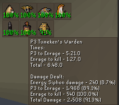
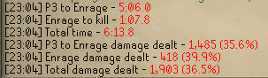

# Tombs of Amascut Stats
This plugin provides detailed phase times, damage tracking (total personal damage and percent of team's damage), and 
other stats for the encounters within the Tombs of Amascut. 
The plugin can be configured to provide these stats as Info Box icons and/or as messages in your chat box. 

### Info Boxes and Tooltip:

### Chat Box:

### Credits:

The foundation and inspiration for this plugin is the [Theatre of Blood Stats](https://github.com/HSJ-OSRS/theatreofbloodstats) plugin by HSJ. Check it out as well!